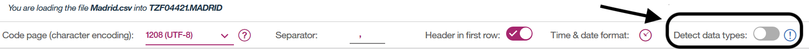
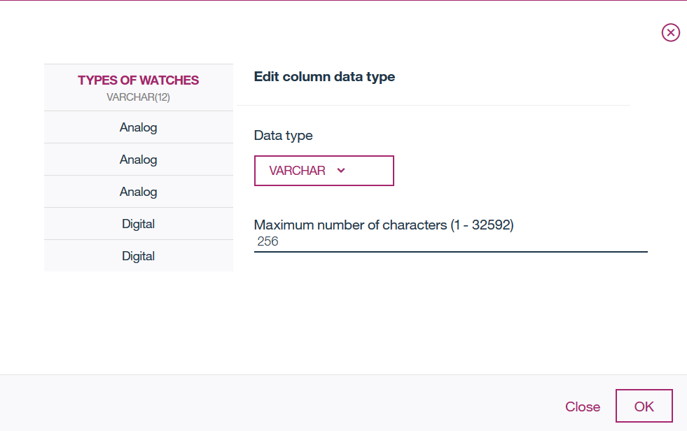
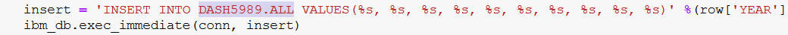

# Generate Insights from multiple data sources using Watson Studio

In this Code Pattern, we will Generate Insights by integrating data from multiple data sources like ``Db2 On Cloud, CSV File, Db2 Warehouse, etc`` using Watson Studio. Telling a story with data usually involves integrating data from multiple sources. Being able to combine data from multiple sources is essential when performing analysis. Here we worked with a few data sources namely ``Db2 On Cloud, CSV File and Db2 Warehouse``, but the power of Watson Studio is that this technique can be applied to other sources like MySQL databases, IBM Db2 Big SQL, Oracle database, PostgreSQL, Microsoft SQL Server, and many more, no matter the dataset size. In this pattern, we will have sales and marketing data of watches in three different cities on three different data sources namely Db2 On Cloud, a csv file and Db2 Warehouse. We will integrate data from all these sources and put it on Db2 warehouse. This integrated data will further be used to derive insights and will be visualized on embedded dashboard.

When the reader has completed this Code Pattern, they will understand how to:

* Connect and get data from multiple data sources.
* Integrate data from multiple data sources.
* Send integrated data to the Db2 Warehouse.
* Derive insights and visualize on Watson Embedded Dashboard.

<!--add an image in this path-->


<!--Optionally, add flow steps based on the architecture diagram-->
## Flow

1. Extract data from local files (csv file).
2. Extract data from Db2 on cloud.
3. Integrate the data in Watson Studio.
4. Send the data to Db2 Warehouse.
5. Visualize and derive insights using Embedded dashboard.

<!--Optionally, update this section when the video is created-->
# Watch the Video

## Pre-requisites
* [IBM Cloud account](https://www.ibm.com/cloud/) : Create an IBM Cloud account.

# Steps

Please follow the below to setup and run this code pattern.

1. [Clone the repo](#1-clone-the-repo)
2. [Create Watson services with IBM Cloud](#2-create-watson-services-with-ibm-cloud)
3. [Create the notebook](#3-create-the-notebook)
4. [Add the data from local system(csv file)](#4-add-the-data-from-local-system(csv-file))
5. [Add the Db2 connection](#5-add-the-db2-connection)
6. [Add the Db2 Warehouse connection](#6-add-the-db2-warehouse-connection)
7. [Update the notebook with credentials and Db2 Warehouse table name](#7-update-the-notebook-with-credentials-and-db2-warehouse-table-name)
8. [Run the notebook](#8-run-the-notebook)

### 1. Clone the repo

Clone this [git repo](https://github.com/IBM/qradar-monitor-device-events.git).
Else, in a terminal, run:

```
$ git clone https://github.ibm.com/raravi86/ETL
```

We’ll be using the file [`data/datasets/Manchester.csv`](data/datasets/Manchester.csv),[`data/datasets/Madrid.csv`](data/datasets/madrid.csv) and [`data/datasets/Glasgow.csv`](data/datasets/Glasgow.csv)

### 2. Create Watson services with IBM Cloud

Create the following services:

* [**Db2**](https://console.bluemix.net/catalog/services/db2) : Create an Db2 instance on your IBM cloud.
* [**Db2 Warehouse**](https://console.bluemix.net/catalog/services/db2-warehouse) : Create an Db2 Warehouse instance on your IBM cloud.
* [**Watson Studio**](https://console.bluemix.net/catalog/services/watson-studio) : Create a Watson Studio instance on your IBM cloud.

## 3. Create the notebook

* In [Watson Studio](https://dataplatform.ibm.com), click on `Create notebook` to create a notebook.
* Create a project if necessary, provisioning an object storage service if required.
* In the `Assets` tab, select the `Create notebook` option.
* Select the `From URL` tab.
* Enter a name for the notebook.
* Optionally, enter a description for the notebook.
* Enter this Notebook URL: https://github.ibm.com/raravi86/ETL/blob/master/notebook/project.ipynb
* Select the free Anaconda runtime.
* Click the `Create` button.


## 4. Add the data from local system (csv file)

#### Add the data to the notebook

* When you clone this repo, you will find three `.csv` files in `data/datasets/`.
* From your project page in Watson Studio, click `Find and Add Data` (look for the `10/01` icon)
and its `Files` tab.
* Click `browse` and navigate to `data/datasets/` and find `Manchester.csv` on your computer.
* Add the file to Object storage.


## 5. Add the Db2 connection

#### (i) First load some data on Db2.
* Launch your Db2 on cloud and click on `load`, as shown below.


* Click on `browse files` and upload `Madrid.csv`, as shown below.


* Choose the default schema and create a table `MADRID`, as shown below.


* Disable `Detect data types` and make sure all the column names are same as in csv file and make sure all the columns have same data types 
`VARCHAR (256)`, as shown below.





* Now click on next and load the data. Once loaded you can view the table which will look like the image, shown below.


* Make sure you note down the table name. In my case the table name is `TZF04421.MADRID`.

#### (ii) Add the Db2 connection to your notebook.

* In your project, click `Add to project` and then select `Connection` tab, as shown below.


* It will redirect you to `new connection` page. Here choose `Db2 on Cloud`, as shown below.


* Fill in your `username,password,hostname and Database`. Leave `use a secure gateway` unchecked.


* `NOTE: You can get username, password, hostname and Database credentials by creating/clicking New Credentials from your Db2 service instance on cloud, as shown below`.


## 6.Add the Db2 Warehouse connection 

This methodology is similar to [step 5](#5-add-the-db2-connection).

#### (i) First load some data on Db2 Warehouse.
* Launch your Db2 on cloud and click on `load`.

* Click on `browse files` and upload `Glasgow.csv`.

* Choose the default schema and create a table `ALL`.

* Disable `Detect data types` and make sure all the column names are same as in csv file and make sure all the columns have same data types 
`VARCHAR (256)`.

* Now click on next and load the data.

* Make sure you note down the table name. In my case the table name is `DASH5989.ALL`.

#### (ii) Add the Db2 connection to your notebook.

* In your project, click `Add to project` and then select `Connection` tab.

* It will redirect you to `new connection` page. Here choose `Db2 Warehouse`.

* Fill in your `username, password, hostname and Database`. Leave `use a secure gateway` unchecked.

* `NOTE: You can get username, password, hostname and Database credentials by creating/clicking New Credentials from your Db2 Warehouse service instance on cloud`.

## 7. Update the notebook with credentials and Db2 Warehouse table name. 

#### Add the data in csv file, to the notebook

* Select the cell below `2.2 Add the data from local system (csv file)` section in the notebook to update the credentials for Object Store.
* Use `Find and Add Data` (look for the `10/01` icon) and its `Files` tab. You should see the file names uploaded earlier. Make sure your active cell is the empty one created earlier.
* Select `Insert to code` below `Manchester.csv`.
* Click `Insert Pandas DataFrame` from the drop down menu.


* After inserting, make sure you change the DataFrame name to `df1`, as shown below.
 `NOTE: This step is very important.`


#### Add the data in Db2 on Cloud, to the notebook

* Select the cell below `2.3 Add the data from Db2` section in the notebook to update the connection credentials for Db2.
* Use `Find and Add Data` (look for the `10/01` icon) and its `Connections` tab. You should see the Db2 name which we earlier connected. Make sure your active cell is the empty one created earlier.
* Select `Insert to code` below `Db2`.
* Click `Insert Pandas DataFrame` from the drop down menu.
* Select the schema in which you created the table.
* Select `Madrid` table.


* After inserting, make sure you change the DataFrame name to `df2`, as shown below.
 `NOTE: This step is very important.`
 
 

#### Add the Db2 Warehouse credentials, to the notebook

* Select the cell below `2.5 Configure to the Db2 Warehouse` section in the notebook to update the connection credentials for Db2 Warehouse.
* Use `Find and Add Data` (look for the `10/01` icon) and its `Connections` tab. You should see the Db2 Warehouse name which we earlier connected. Make sure your active cell is the empty one created earlier.
* Select `Insert to code` below `Db2 Warehouse`.
* Click `Insert Credentials` from the drop down menu.
* If the credentials are written as `credential_2` change them to `credentials_1`. Make sure that the credentials name is `credentials_1`.
 `NOTE: This step is very important.`
 


#### Update the Db2 Warehouse table name

* See the cell below `3. Send the data to Db2 Warehouse` section in the notebook to update the table name.
* In my case the table name in Db2 Warehouse is `DASH5989.ALL`.




## 8. Run the notebook

When a notebook is executed, what is actually happening is that each code cell in
the notebook is executed, in order, from top to bottom.

Each code cell is selectable and is preceded by a tag in the left margin. The tag
format is `In [x]:`. Depending on the state of the notebook, the `x` can be:

* A `blank`, this indicates that the cell has never been executed.
* A `number`, this number represents the relative order this code step was executed.
* A `*`, this indicates that the cell is currently executing.

There are several ways to execute the code cells in your notebook:

* One cell at a time.
  * Select the cell, and then press the `Play` button in the toolbar.
* Batch mode, in sequential order.
  * From the `Cell` menu bar, there are several options available. For example, you
    can `Run All` cells in your notebook, or you can `Run All Below`, that will
    start executing from the first cell under the currently selected cell, and then
    continue executing all cells that follow.
* At a scheduled time.
  * Press the `Schedule` button located in the top right section of your notebook
    panel. Here you can schedule your notebook to be executed once at some future
    time, or repeatedly at your specified interval.

For this Notebook, you can simply `Run All` cells.

<!--Optionally, include any troubleshooting tips (driver issues, etc)-->

## 9. Visualize and Derive Insights using Embedded Dashboard Analytics

### Embedded Dashboard Analytics 

IBM® Cognos Dashboard Embedded Analytics provides developers the ability to embed a visualization platform directly into their application. Power analytics for your customers, either as standalone dashboards or integrated into your application. Develop your own analytics solution easily by using embedded dashboards and reports and save months of development effort.
You as a developer have the flexibility to define the user workflow and control the options available to users. You can choose from a guided exploration of the analysis through authored fixed dashboards, to a free-form analytic exploration environment in which users choose their own visualizations – and virtually anything in between.
The IBM Cognos Dashboard Embedded lets you, the developer, painlessly add end-to-end data visualization capabilities to your application so your users can easily drag and drop to quickly find valuable insight and create visualizations on their own.

#### Key Features of IBM Cognos Dashboard Embedded are as follows:

- Live connection to underlying data
- Interactive dashboards produce visualizations directly from your data in real-time.
- Smart creation of visualizations
- Smart data analysis and visualization capabilities help users discover underlying patterns and meanings in their data.
- Interactive exploration of data
- Data can be explored using filtering and navigation paths.
- Embedded in your application
- Because dashboards are fully embedded, dashboards are integrated into your application's context, keeping users engaged.

### Steps to create a Dashboard

#### (i) Provisioning a Dashboard Embedded analytics service Instance to the Watson Studio Project

* Click on "Add to Project" button to add the Embedded Dashboard Analytics service.


#### (ii) Creating the Embedded Dashboard service and connections

*  Create the New Embedded Dashboard service or if you already have one then from the drop down prompt, select the Dashboard Embedded service from the list. And click on Save button in the bottom.


* Select the Template for your Dashboard.


* Click on selected sources '+' button to connect to the DB2 Warehouse.


* Connect to the DB2 Warehouse databse(DASH5989). See below screenshot for details.


* After connecting to the DB2 Warehouse database, you will see `All` as a new datasource under the Selected Sources.


* Click on `All` data source and now you can see the column names displayed vertically under `All`. These columns can be used for dashboard as a source. 


#### (iii) Creating the Dashboard

We will create 2 tabs (`Gross Profit and Revenue Analysis` & `Unit Sold Analysis`). 

Under Gross Profit and Revenue Analysis tab, we would create 6 widgets.

 - Gross Profit analysis by year widget
 - Gross Profit analysis by Store Location widget
 - Revenue Generated by Order Method
 - Revenue Generated by Store Location
 - Gross Profit Analysis by Order Method
 - Types of Watches sold Analysis by Order Method

##### Gross Profit analysis by year widget

- To create this widget, firstly click on the visualizations icon and select and drag the World Cloud chart to the dashboard pane. See below screenshot for details.


##### Gross Profit analysis by Store Location widget

- Add `Store Location` and `Gross Profit` to the Word Cloud Chart. See screenshot for details.


##### Revenue Generated by Order Method widget

- Add `Store Location` and `Order Method` to the `Bar chart`.  See screenshot for details.


##### Revenue Generated by Store Location

- Add `Store Location` and `Revenue Generated` to the `Tree Map` chart`.  See screenshot for details.


##### Similarly and painlessly add end-to-end data visualization capabilities to your application so your users can easily drag and drop to quickly find valuable insight and create visualizations on their own.

# Sample output


# Troubleshooting


<!-- keep this -->
## License

[Apache 2.0](LICENSE)
