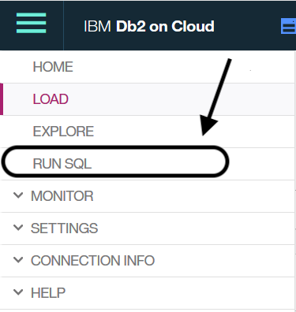

# Troubleshooting

When we upload a `csv file` to Db2 or Db2 Warehouse or any other database, the column names which have spaces (Eg: First Name) are by default taken with an underscore (Eg: First_Name).

I'll give you two ways to tackle this issue: 

(i) Manually change by disabling `Detect data types` while uploading.

In our case, we have to change the column names from,

 ```  
 TYPES_OF_WATCHES to TYPES OF WATCHES
 ORDER_METHOD to ORDER METHOD
 STORE_LOCATION to STORE LOCATION
 UNITS_SOLD to UNITS SOLD
 MANUFACTURING_COST_PER_UNIT____USD_ to MANUFACTURING COST PER UNIT ($ USD)
 MANUFACTURING_COST____USD_ to MANUFACTURING COST ($ USD)
 UNIT_SALE_PRICE____USD_ to UNIT SALE PRICE ($ USD)
 REVENUE_GENERATED____USD_ to REVENUE GENERATED ($ USD)
 GROSS_PROFIT____USD_ to GROSS PROFIT ($ USD)
 
 ``` 
 
(ii) Run the following commands in `RUN SQL` as shown below ,
      

 
 ```
 ALTER TABLE xxxxxxxx.XYZ RENAME COLUMN TYPES_OF_WATCHES TO "TYPES OF WATCHES";
 ALTER TABLE xxxxxxxx.XYZ RENAME COLUMN ORDER_METHOD TO "ORDER METHOD";
 ALTER TABLE xxxxxxxx.XYZ RENAME COLUMN STORE_LOCATION TO "STORE LOCATION";
 ALTER TABLE xxxxxxxx.XYZ RENAME COLUMN UNITS_SOLD TO "UNITS SOLD";
 ALTER TABLE xxxxxxxx.XYZ RENAME COLUMN MANUFACTURING_COST_PER_UNIT____USD_ TO "MANUFACTURING COST PER UNIT ($ USD)";
 ALTER TABLE xxxxxxxx.XYZ RENAME COLUMN MANUFACTURING_COST____USD_ TO "MANUFACTURING COST ($ USD)";
 ALTER TABLE xxxxxxxx.XYZ RENAME COLUMN UNIT_SALE_PRICE____USD_ TO "UNIT SALE PRICE ($ USD)";
 ALTER TABLE xxxxxxxx.XYZ RENAME COLUMN REVENUE_GENERATED____USD_ TO "REVENUE GENERATED ($ USD)";
 ALTER TABLE xxxxxxxx.XYZ RENAME COLUMN GROSS_PROFIT____USD_ TO "GROSS PROFIT ($ USD)";
 
 ``` 
 Replace `xxxxxxxx.XYZ` with your table name.
