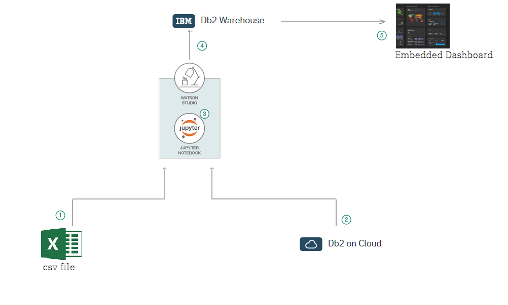

# Short title

Generate Insights from multiple data sources.

# Long title

Generate Insights from multiple data sources using Watson Studio.

# Author

* Rahul Reddy Ravipally raravi86@in.ibm.com
* Srikanth Manne SRIKANTH.MANNE@in.ibm.com
* Manjula Hosurmath mhosurma@in.ibm.com

# URLs

### Github repo

* [Generate Insights from multiple data sources using Watson Studio](https://github.com/IBM/generate-insights-from-multiple-data-sources)

### Other URLs

* Video URL
* Demo URL

# Summary

# Technologies

* [Database Management](https://www.ibm.com/analytics/us/en/db2/): A database management system (DBMS) is system software for creating and managing databases.

* [Data Aggregation](https://en.wikipedia.org/wiki/Data_aggregation): Data aggregation is the compiling of information from databases with intent to prepare combined datasets for data processing.

* [Data Visulaization](https://en.wikipedia.org/wiki/Data_visualization): Data Visulaization isthe representation of information in the form of a chart, diagram, picture, etc.

# Description

# Flow

1. Extract data from local files (csv file).
2. Extract data from Db2 on cloud.
3. Integrate the data in Watson Studio.
4. Send the data to Db2 Warehouse.
5. Visualize and derive insights using Embedded dashboard.

# Instructions

> Find the detailed steps for this pattern in the [readme file](https://github.com/IBM/generate-insights-from-multiple-data-sources/blob/master/README.md). The steps will show you how to:

1. Download the code from GitHub
2. Create Watson services with IBM Cloud
3. Create the notebook
4. Add the data from local system(csv file)
5. Add the Db2 connection
6. Add the Db2 Warehouse connection
7. Update the notebook with credentials and Db2 Warehouse table name
8. Run the notebook

# Components and services

* Watson Studio
* IBM DB2 
* IBM DB2 Warehouse

# Runtimes

* Python 3

# Related IBM Developer content

* 

# Related links

*
*

# Announcement

