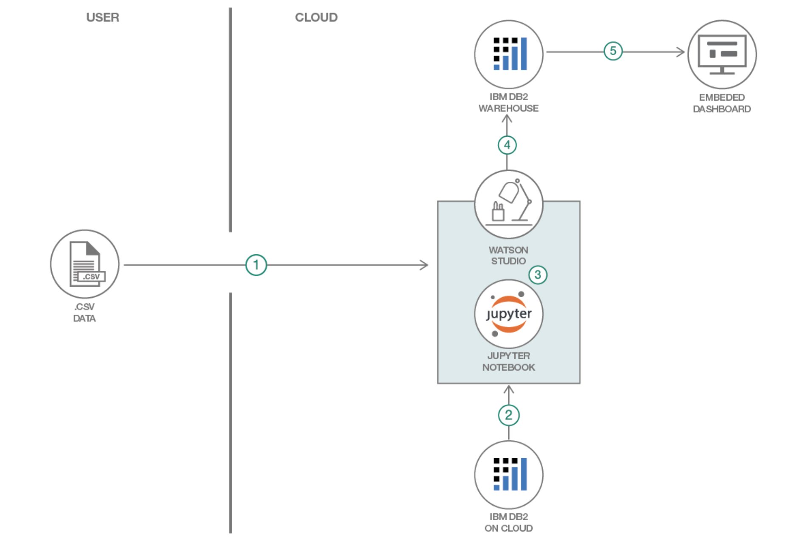

# Short title

Generate Insights from multiple data sources.

# Long title

Generate Insights from multiple data sources using Watson Studio.

# Author

* Rahul Reddy Ravipally raravi86@in.ibm.com
* Srikanth Manne SRIKANTH.MANNE@in.ibm.com
* Manjula Hosurmath mhosurma@in.ibm.com

# URLs

### Github repo

* [Generate Insights from multiple data sources using Watson Studio](https://github.com/IBM/generate-insights-from-multiple-data-sources)

### Other URLs

* Video URL

# Summary

Data and business analysis is a very valuable skill to have. It could mean the difference between a mediocre business and an exceptional one. For any company to do Data or Business analysis, having appropriate amount of data is the key.A company's data may have been stored on multiple sources. If we are able to aggregate all this related data which is stored on multiple sources and perform analysis, it would be very useful for the business, to interpret the data and to take right decision in accordance with the business environment. It could mean the difference between a mediocre business and an exceptional one.

# Technologies

* [Analytics](https://en.wikipedia.org/wiki/Analytics): Uncover insights with data collection, organization, and analysis.

* [Databases](https://www.ibm.com/analytics/us/en/db2/): Capture, store, analyze, and manage collections of data.

* [Data Aggregation](https://en.wikipedia.org/wiki/Data_aggregation): Data aggregation is the compiling of information from databases with intent to prepare combined datasets for data processing.

* [Data Visulaization](https://en.wikipedia.org/wiki/Data_visualization): Data Visulaization is the representation of information in the form of a chart, diagram, picture, etc.

* [Python](https://en.wikipedia.org/wiki/Python_(programming_language)): An open-source interpreted high-level programming language for general-purpose programming.

# Description

In today's digital world, data analysis is extremely necessary due to the presence of online businesses.
Such, businesses can have its consumer base completely stolen by a competitor with a better understanding of the consumers' needs,
compared to a brick-and-mortar stall,which may still draw business from random passers-by.

Data and business analysis is a very valuable skill to have. It could mean the difference between a mediocre business and an exceptional one. For any company to do Data or Business analysis, having appropriate amount of data is the key.

A company's data may have been stored on multiple sources. In this code pattern we will consume/extract the data from multiple data sources using Watson Studio and load it into one data file/database. This data will further be used for visualization and analysis, and to derive insights about the company's performance.

# Flow

1. Extract data from local files (csv file).
2. Extract data from Db2 on cloud.
3. Integrate the data in Watson Studio.
4. Send the data to Db2 Warehouse.
5. Visualize and derive insights using Embedded dashboard.

# Instructions

> Find the detailed steps for this pattern in the [readme file](https://github.com/IBM/generate-insights-from-multiple-data-sources/blob/master/README.md). The steps will show you how to:

1. Download the code from GitHub
2. Create Watson services with IBM Cloud
3. Create the notebook
4. Add the data from local system(csv file)
5. Add the Db2 connection
6. Add the Db2 Warehouse connection
7. Update the notebook with credentials and Db2 Warehouse table name
8. Run the notebook

# Components and services

* Watson Studio
* IBM DB2 
* IBM DB2 Warehouse

# Runtimes

* Python 3

# Related IBM Developer content

* 

# Related links

*
*

# Announcement

In this information age, data is one of the important factors that could redefine your business and ensure its growth.  Big Data is emerging as the next frontier for business development. You need some tools to collect the data from customers and interpret it effectively. Big Data and related technologies – from data warehousing to analytics and business intelligence  – are transforming the business world.

Data aggregation and data visualization would be very useful for your business in order to interpret the data and to take right decision in accordance with the business environment. It will simplify the process of understanding the business insights and also help you to find new business opportunities by accessing, evaluating & interpreting the data.

Data and business analysis is a very valuable skill to have. It could mean the difference between a mediocre business and an exceptional one. 

A company's data may have been stored on multiple sources. In this code pattern we will consume/extract the data from multiple data sources using Watson Studio and load it into one data file/database. This data will further be used for visualization and analysis, and to derive insights about the company's performance.
